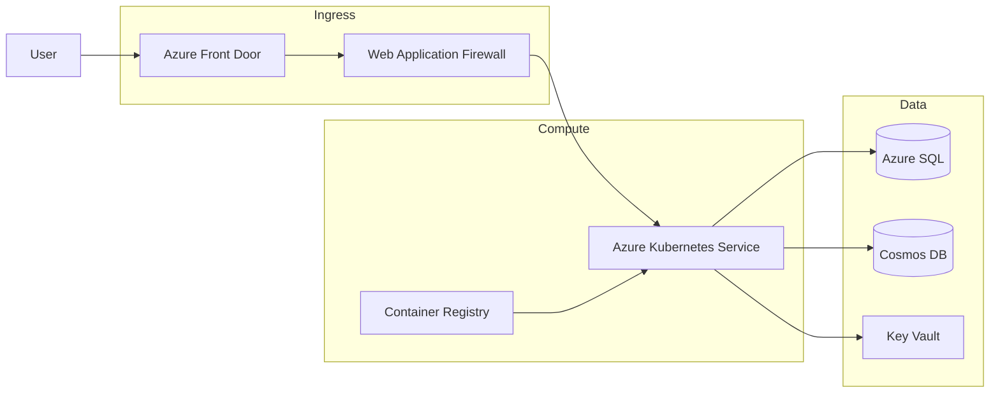

# Presentation Markdown Template

Use this template when co-authoring a presentation. This markdown file serves as the "spec" before creating the actual PowerPoint.

## Instructions for Agents

When using `/doc-coauthoring` to create this spec:

1. **Ask clarifying questions** - Understand audience, goals, key messages
2. **Draft speaker notes** - Create detailed speaker notes for each slide based on user input
3. **Create visual representations** - For diagrams and charts, create Mermaid diagrams to visualize the concept
4. **Iterate with user** - Refine content, visuals, and speaker notes collaboratively

The agent should proactively generate speaker notes and Mermaid diagrams based on the user's requirements. Don't wait for the user to write these - propose them and refine together.

---

## Metadata

```
Title: [Presentation title]
Author: [Author name]
Date: [Date]
Audience: [Who is this for?]
Goal: [What should the audience think/feel/do after?]
Duration: [Expected presentation length]
```

---

## Slide 1: [Title]

**Type:** [Title | Section header | Content | Architecture | Data/Chart | Comparison | Summary]

**Key Message:** [One sentence - what should the audience take away from this slide?]

**Content:**
- [Bullet points, data, or description of visuals]
- [Keep this verbose - we'll trim later]

**Visuals:**

Description: [Describe the visual - what it shows, key elements, relationships]

```mermaid
[Mermaid diagram representing the visual]
```

**Speaker Notes:**
[Detailed notes on what the presenter will say. Include:
- Key talking points
- Transitions from previous slide
- Data or context not shown on slide
- Anticipated questions and answers]

---

## Slide 2: [Title]

**Type:** [Type]

**Key Message:** [One sentence takeaway]

**Content:**
- [Content details]

**Visuals:**

Description: [Visual description]

```mermaid
[Mermaid diagram if applicable - flowchart, sequence, architecture, etc.]
```

**Speaker Notes:**
[Detailed speaker notes]

---

## Slide N: [Title]

[Repeat structure for each slide]

---

## Example: Architecture Slide

Here's an example of a fully filled out slide:

**Type:** Architecture diagram

**Key Message:** Our solution uses Azure's managed services to minimize operational overhead while maximizing scalability.

**Content:**
- Web traffic enters through Azure Front Door
- Application runs on Azure Kubernetes Service
- Data persisted in Azure SQL and Cosmos DB
- Secrets managed in Key Vault

**Visuals:**

Description: Three-tier architecture showing ingress, compute, and data layers with Azure services.



**Speaker Notes:**
Let me walk you through our architecture. Traffic comes in through Azure Front Door, which gives us global load balancing and CDN capabilities. The Web Application Firewall protects against common attacks.

Our application runs on AKS - Azure Kubernetes Service. We chose this because the team already has Kubernetes expertise, and it gives us the flexibility to scale individual microservices independently. Container images are stored in Azure Container Registry.

For data, we're using a polyglot persistence approach. Azure SQL handles our transactional data - orders, inventory, user accounts. Cosmos DB is for our product catalog and session data where we need global distribution and low latency. All secrets and connection strings are in Key Vault - nothing hardcoded.

One thing you might ask: why not App Service? We evaluated it, but the team's existing investment in Kubernetes and the need for fine-grained scaling made AKS the better choice for this workload.

---

## Appendix Slides (if needed)

### Appendix A: [Title]

**Purpose:** [Why is this in appendix vs main deck?]

**Content:**
- [Detailed content for backup/reference]

---

## Checklist Before Creating PPTX

- [ ] Each slide has exactly one key message
- [ ] Titles are action titles (state the takeaway, not just topic)
- [ ] No slide has more than 3-5 bullet points
- [ ] Story flows logically from slide to slide
- [ ] Executive summary / conclusion is clear
- [ ] Appendix contains detailed backup material
- [ ] Visuals have both descriptions AND Mermaid diagrams where applicable
- [ ] Speaker notes are detailed and complete for each slide
